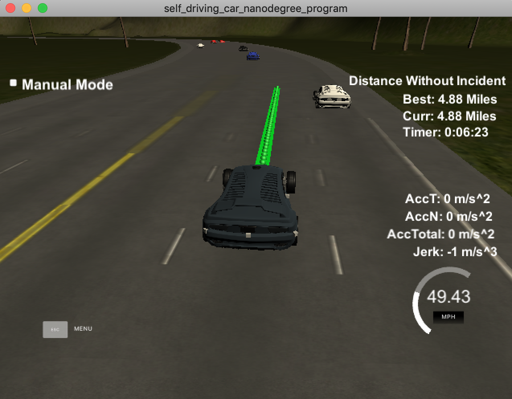

# Path Planning
[](http://www.udacity.com/drive)

This project is part of the [Udacity Self-Driving Car Nanodegree](https://www.udacity.com/drive) program, and some of the code are leveraged from the lecture materials.

---

## Objective
This project uses a path planner to safely navigate around a virtual 3-lane highway with other traffic that is driving +-10 MPH of the 50 MPH speed limit in a simulator. Car's localization and sensor fusion data are provided. There is also a sparse map list of waypoints around the highway.
There are some strategies we'd like the car to follow:
1. Drive as close as possible to the 50 MPH speed limit, which means passing slower traffic when possible, note that other cars will try to change lanes too.
2. Avoid hitting other cars at all cost.
3. Driving inside of the marked road lanes at all times.
4. The car should not experience total acceleration over 10 m/s^2 and jerk that is greater than 10 m/s^3.
5. The car is able to drive at least 4.32 miles without incident.



---

## Overview
### 1. Data
#### 1.1 Highway Map
The map of the highway is in data/highway_map.txt.
Each waypoint in the list contains [x,y,s,dx,dy] values.
* x, y: the waypoint's map coordinate position
* s: the distance along the road to get to that waypoint in meters
* dx, dy: define the unit normal vector pointing outward of the highway loop

The highway's waypoints loop around so the Frenet s value, distance along the road, goes from 0 to 6945.554.

#### 1.2 Main Car's Localization Data (No Noise)

* ["x"]: x position in map coordinates
* ["y"]: y position in map coordinates
* ["s"]: s position in Frenet coordinates
* ["d"]: d position in Frenet coordinates
* ["yaw"]: yaw angle in the map
* ["speed"]: speed in MPH

#### 1.3 Previous Path Data

The previous list but with processed points removed, can be a nice tool to show how far along the path has processed since last time.
* ["previous_path_x"]: x points previously given to the simulator
* ["previous_path_y"]: y points previously given to the simulator
* ["end_path_s"]: Frenet s value of the last point in the previous list
* ["end_path_d"]: Frenet d value of the last point in the previous list

#### 1.4 Sensor Fusion Data (No Noise)
A list of all other car's attributes on the same side of the road.

* car's unique ID
* car's x position in map coordinates
* car's y position in map coordinates
* car's x velocity in m/s
* car's y velocity in m/s
* car's s position in Frenet coordinates
* car's d position in Frenet coordinates.

### 2. Code Structure
* src/main.cpp -  main code that talks to the simulator.
* src/vehicle.cpp - vehicle class that represents the properties of a vehiclej (data from section 1.2).
* src/path_planner.cpp - path planner class that handles the algorithm of planning and trajectory generation.
* src/helper_functions.cpp - helper functions.

### 3. Details of the Path Planner
#### 3.1 State Machine
The state machine consists of three states: KL (Keep Lane), LCL (Lane Change Left), LCR (Lane Change Right).
And KL can transition to LCL and LCR while LCL and LCR can only transition back to KL. This is to prevent the vehicle changes lanes too frequently.

The path planner will follow the steps below to determine the best next state:
1. Determine what the possible successor states (path_planner.cpp, line 158-172).

2. Get surrounding vehicles information from sensor fusion data (path_planner.cpp, line 96-110).

  This will return the closet vehicle ahead and behind comparing to the car's current location on all lanes within 50 m.  

3. Use a cost function to figure out the best safely executable state (path_planner.cpp, line 135-156 and line 174-194).
  * Given each possible successor states, calculate the cost based on the following rules:
    * If there are vehicles within the safe ranges on the targeting lane of that state, then consider the state is not safely executable and set the cost to 99.
  (`ahead_safe_distance = 40`, `behind_safe_distance = 30`)
    * If the state is safely executable, calculate the cost using the following equation:  `pow(this->desired_speed_ - ahead_vehicle.car_speed_, 2)/pow(this->desired_speed_, 2) + 0.01*pow(new_lane-this->current_lane_, 2)`


4. Find the best state with lowest cost. Preferred to stay with the same lane if the cost are the same within different states (aka. KL is the preferred state).

#### 3.3 Trajectory Generation
The trajectory generator (path_planner.cpp, line 196-342) is basically the same as the one in the course video. The only changes here is how to determine the reference speed for the car to follow.
* Calculate the new lane the car will be heading using the new state given to the trajectory generator.
* Get the minimum collision distance from the car ahead on the new lane using sensor fusion data.
* Determine the speed for the car to follow:
  * Car ahead within safe range (30 m) and car speed is faster than the car ahead - slow down and follow the ahead car's speed.
  * Car ahead within safe range (30 m) and car speed is slower than the car ahead - slowly increase the car speed until it reaches the ahead car's speed or the speed limit.
  * If no car ahead, slowly increase the car speed until it reaches the speed limit.

---

## Basic Build Instructions

1. Clone this repo.
2. Make a build directory: `mkdir build && cd build`
3. Compile: `cmake .. && make`
4. Run it: `./path_planning`.
5. Open the Term3 simulator downloaded from https://github.com/udacity/self-driving-car-sim/releases/tag/T3_v1.2

---

## Dependencies

* cmake >= 3.5
  * All OSes: [click here for installation instructions](https://cmake.org/install/)
* make >= 4.1
  * Linux: make is installed by default on most Linux distros
  * Mac: [install Xcode command line tools to get make](https://developer.apple.com/xcode/features/)
  * Windows: [Click here for installation instructions](http://gnuwin32.sourceforge.net/packages/make.htm)
* gcc/g++ >= 5.4
  * Linux: gcc / g++ is installed by default on most Linux distros
  * Mac: same deal as make - [install Xcode command line tools]((https://developer.apple.com/xcode/features/)
  * Windows: recommend using [MinGW](http://www.mingw.org/)
* [uWebSockets](https://github.com/uWebSockets/uWebSockets)
  * Run either `install-mac.sh` or `install-ubuntu.sh`.
  * If you install from source, checkout to commit `e94b6e1`, i.e.
    ```
    git clone https://github.com/uWebSockets/uWebSockets
    cd uWebSockets
    git checkout e94b6e1
    ```
